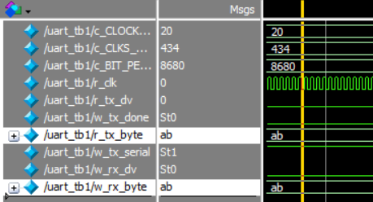
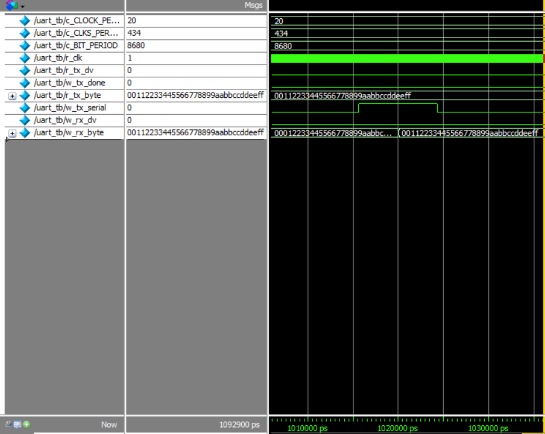

# 3.-UART_Protocol_In_Verilog

## Overview
This project implements a UART (Universal Asynchronous Receiver/Transmitter) protocol in Verilog HDL, designed to establish serial communication between an FPGA and external devices. 
The module supports both transmitting and receiving 8-bit data with configurable baud rate, ensuring asynchronous data exchange using minimal I/O lines

## Key Features

Full-duplex UART communication

Configurable baud rate

Supports start, data, parity (optional), and stop bits

FIFO-based buffering for stable data handling (optional extension)

Fully synthesizable and testbench verified

## UART Frame Format

| Start Bit (0) | Data Bits (LSB first) | Parity Bit (optional) | Stop Bit (1) |

1. Start bit: 1 bit (always 0)

2. Data bits: 8 bits (default)

3. Parity bit: Optional (even/odd)

4. Stop bit: 1 bit (always 1)

## Simulation & Testing

Run uart_tb.v in simulation tools (ModelSim, Vivado, etc.)

Use waveform analysis to validate TX/RX signal timing

Inject and observe 8-bit serial data patterns

